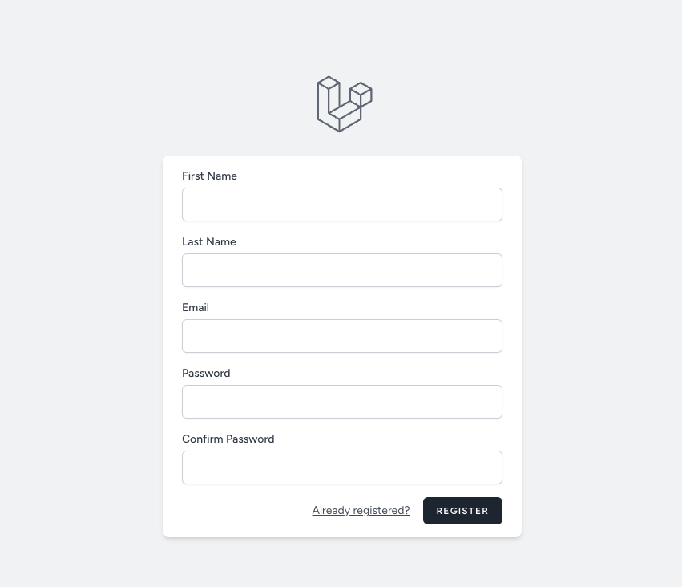
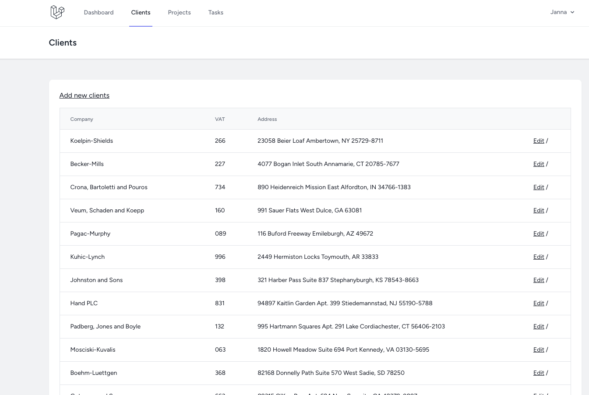
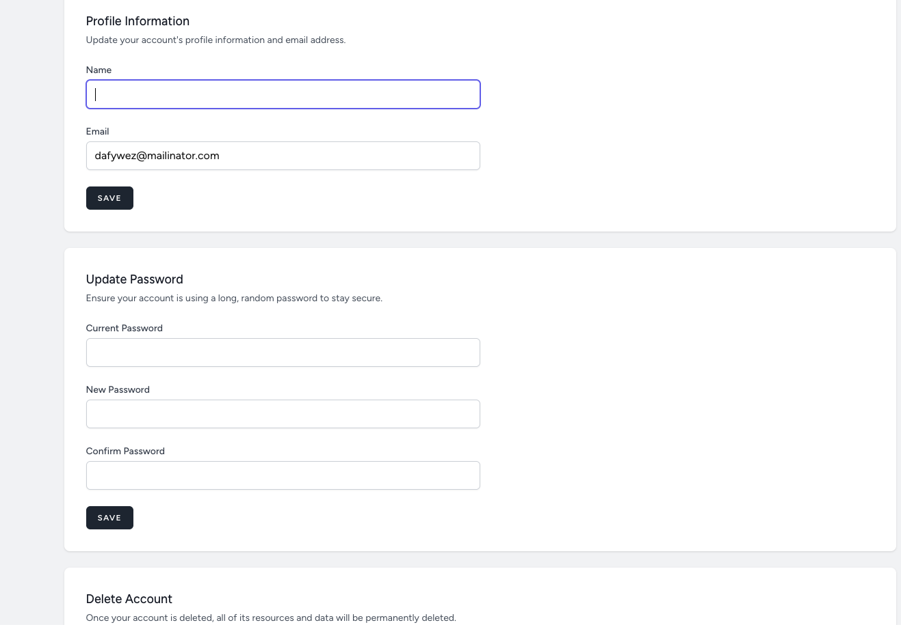
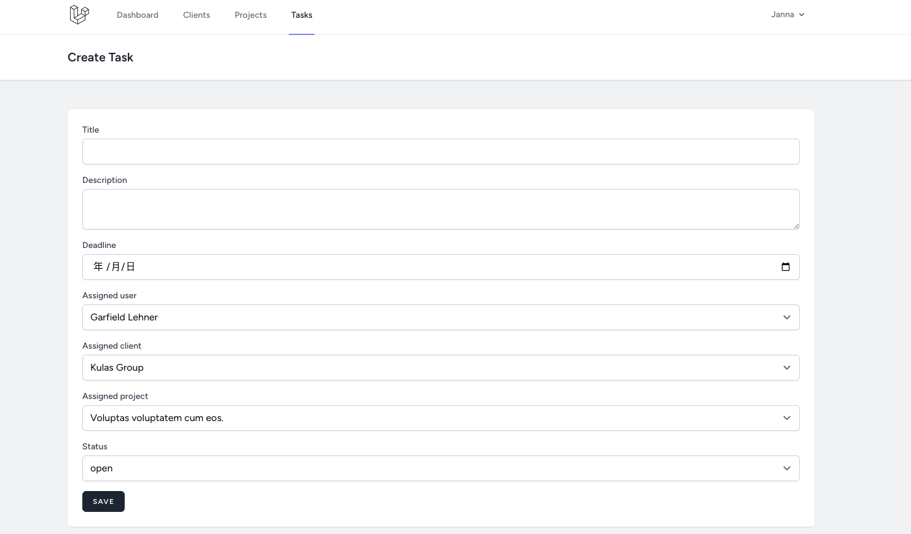

<h1 align="center">Laravel 11 小型 CRM 系統</h1>


## 簡介

[TOC]

## 預覽圖










## 簡介
laravel 11 小型 CRM 系統，使用 Laravel 11 開發，實作客戶管理、權限管理、產品管理、訂單管理、任務管理等功能。

###### 另外這次配合使用 Laravel Herd 與 Laravel Sail 進行開發

## 使用者CRUD
使用Laravel 的 Laravel Breeze 來進行使用者的CRUD

## 使用者權限管理
使用Laravel Permission 來進行權限管理

## 客戶端CRUD
使用 Laravel 的 Breeze blade 模板進行客戶端的CRUD

## 任務CRUD
使用 Laravel 的 Breeze blade 模板進行任務模板的CRUD

> 每個CRUD都會練習到Laravel的基礎功能包括但不限於：
> - Blade 模板
> - Eloquent ORM
> - Middleware
> - Form Request
> - Validation
> - Pagination
> - Query Builder
> - Migration
> - Factory
> - Seeder
> - Enum

# 權限實作
通常做法會有兩種：
1. @role
2. @can

## @role
這種方式比較偏向針對角色來進行權限管理，功能該權限的對象比較單一性，如：user功能只能有admin角色才能使用，不能給其他角色
### 使用方法
#### blade
```blade
@role('admin')
    <p>This is visible to users with the admin role. Gets translated to
    \Laratrust::hasRole('admin')</p>
@endrole
```
#### routes
```php
Route::get('admin', function () {
    return view('admin')->middleware('role:admin');
});
```

## @can
比較正規的做法，會將permission與role這兩張表進行結合，而功能只會開放該permission的對象，不會限制在role上
### 使用方法
#### blade
```blade
@can('edit articles')
    <a href="/edit">Edit</a>
@endcan
```
#### routes
```php
Route::get('edit', function () {
    return view('edit')->middleware('can:edit articles');
});
```

#### controller
```php
public function edit()
{
    Gate::authorize(PermissionEnum::DELETE_CLIENTS->value);

    return view('edit');
}
```
